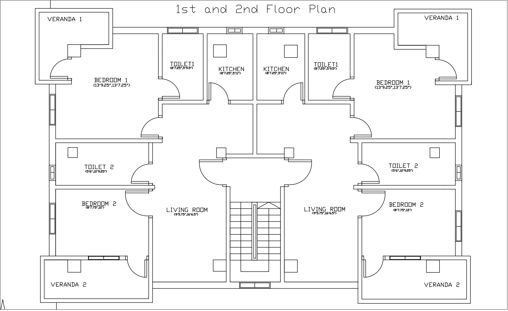

# Electrical Service Design Project : Course EEE 414
Electrical service design is the graphical depiction of various electrical loads such as lighting, power, distribution board schematics, fire prevention design, public address system etc., and therefore must precede every electrical installation. This work proposes an AutoCAD-based method for designing electrical services for a duplex building in accordance with the applicable standards and regulations. The outcome demonstrates a well-balanced load system with an effective protection system employing the recommended ratings provided by the applicable rules and standard.

## Floor Plan of the Design

